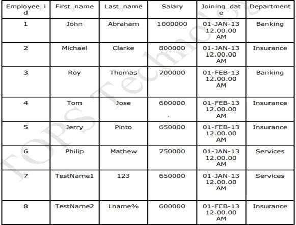
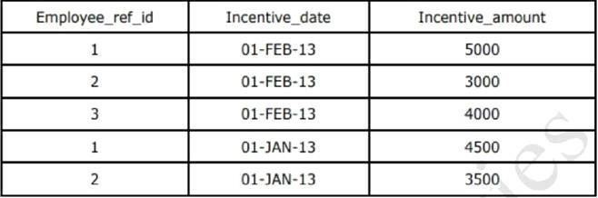

```sql
create table Employee (Employee_id int primary key, First_name varchar(10), Last_name varchar(10), salary int, joinining_date datetime, Department varchar(20));
```

``` sql
insert into Employee values (1, "John","Abraham",1000000, "2013-01-01 12:00:00","Banking");
insert into Employee values (2, "Michael","Clarke",800000, "2013-01-01 12:00:00","Insurance");
insert into Employee values (3, "Roy","Thomas",700000, "2013-02-01 12:00:00","Banking");
insert into Employee values (4, "Tom","Jose",600000, "2013-02-01 12:00:00","Insurance");
insert into Employee values (5, "Jerry","Pinto",650000, "2013-02-01 12:00:00","Insurance");
insert into Employee values (6, "Philip","Mathew",750000, "2013-01-01 12:00:00","Services");
insert into Employee values (7, "TestName1","123",650000, "2013-01-01 12:00:00","Services");
insert into Employee values (8, "TestName2","Lname%",600000, "2013-02-01 12:00:00","Insurance");
```



```sql
CREATE TABLE Incentive (Employee_ref_id int, FOREIGN KEY(Employee_ref_id) REFERENCES employee(Employee_id), Incentive_date date, Incentive_amount int);
```

```sql
insert into Incentive values (1, "01-FEB-13",5000);
insert into Incentive values (2, "01-FEB-13",3000);
insert into Incentive values (3, "01-FEB-13",4000);
insert into Incentive values (1, "01-JAN-13",4500);
insert into Incentive values (2, "01-JAN-13",3500);
```

---------------------------------------------------------------------------------------------------------------------------------------------------

##### 1. Get First_Name from employee table using alias name “Employee Name”.

```sql
 select First_name as Employee_Name from Employee;
```

##### 2. Get FIRST_NAME, Joining year, Joining Month and Joining Date fromemployee table.

```sql
 select First_name, date(joinining_date) as joinining_date from Employee;
```

##### 3. Get all employee details from the employee table order by First_NameAscending and Salary descending.

```sql
select * from Employee order by First_name asc, salary desc; 
```

##### 4. Get employee details from employee table whose first name contains ‘o’. 

```sql
select * from Employee where First_name like '%o%';
```

##### Get employee details from employee table whose joining month is “january”.

```sql
select * from employee where month(joinining_date)=01;
```

##### 5. Get department, total salary with respect to a department from employeetable order by total salary descending.

```sql
 select Department, sum(salary) as Total_Salary from Employee group by Department order by Total_Salary desc; 
```

##### 6. Get department wise maximum salary from employee table order by salary ascending.

```sql
 select Department, max(salary) as Maximum_Salary from Employee group by Department order by Maximum_Salary asc; 
```

##### 7. Select first_name, incentive amount from employee and incentives table for those employees who have incentives and incentive amount greater than 3000.

```sql
select employee.First_name, incentive.Incentive_amount from incentive left join employee on employee.Employee_id=incentive.Employee_ref_id where incentive.Incentive_amount>3000;
```

##### 8. Select 2nd Highest salary from employee table.
```sql
select max(salary) as Maximum_Highest_Salary from employee group by salary order by  salary desc limit 1,1;
```

##### 9. Select first_name, incentive amount from employee and incentives table for all employees who got incentives using left join.

```sql
select employee.First_name, incentive.Incentive_amount from incentive left join employee on employee.Employee_id=incentive.Employee_ref_id;
```

##### 10. Create View OF Employee table in which store first name ,last name and salary only.

```sql
create view employee_info as select First_name, Last_name, salary from Employee;
```

##### 11. Create Procedure to find out department wise highest salary.

```sql
delimiter /
Create Procedure salary()
Begin
select max(salary) from employee group by department;
End;
/
```
```sql
call salary();
```

##### 12. Create After Insert trigger on Employee table which insert records in view table.

```sql
create table view_employee_table (id int primary key auto_increment, inserted_time time);
```

```sql
delimiter /
create trigger add_employee_details 
after insert on employee 
for each row 
begin 
    insert into view_employee_table (inserted_time)
    values (now());
end /
```