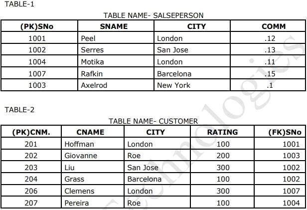

```sql
create table SalsePerson (SNo int primary key , Sname varchar(10), City varchar(15), Comm float);
```

```sql
insert into SalsePerson values (1001,"Peel","London",.12);
insert into SalsePerson values (1002,"Serres","San Jose",.13);
insert into SalsePerson values (1004,"Motika","London",.11);
insert into SalsePerson values (1007,"Rafkin","Barcelona",.15);
insert into SalsePerson values (1003,"Axelrod","Now York",.1);
```

```sql
create table customer (Cnm int primary key, Cname varchar(10), City varchar(15), Rating int, Sno int, foreign key (Sno) references salseperson(SNo));
```

```sql
insert into Customer values(201,"Hoffman","London",100,1001);
insert into Customer values(202,"Giveonme","Roe",200,1003);
insert into Customer values(203,"Liu","San Jose",300,1002);
insert into Customer values(204,"Grass","Barcelona",100,1002);
insert into Customer values(206,"Clemens","London",300,1007);
insert into Customer values(207,"Pereira","Roe",100,1004); 
```

---------------------------------------------------------------------------------------------------------------------------------------------------

##### 1. All orders for more than $1000

```sql
select * from orders where amount>1000;
```

##### 2. Names and cities of all salespeople in London with commission above 0.10.

```sql
select Sname, City from salseperson where City="London" and Comm>0.10;
```

##### 3. All salespeople either in Barcelona or in London

```sql
select * from salseperson where City in ("Barcelona", "London");
```

##### 4. All salespeople with commission between 0.10 and 0.12. (Boundary values should be excluded).

```sql
select * from salseperson where Comm between 0.10 and 0.12 limit 1,1;
```

##### 5. All customers excluding those with rating <= 100 unless they are located in Roe.

```sql
select * from customer where Rating <= 100 or (City = "Roe");
```

##### 6. All orders except those with 0 or NULL value in amt field.

```sql
select * from orders where amt!=0 or amt != null;
``` 

##### 7. Count the number of salespeople currently listing orders in the order table.

```sql
select count(distinct Sno) from customer;
```

##### 8. Largest order taken by each salesperson, date wise.

```sql
select max(Rating) as Largest_Order, Sno from customer group by (Sno);
```
