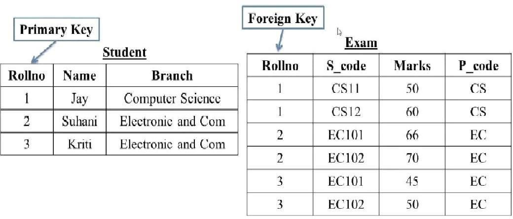
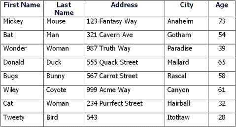

```sql
create table Student (Rollno int(2) primary key, Name varchar(20), Branch varchar(50));
```

```sql
insert into Student values (1, "Jay", "Computer Science");
insert into Student values (2, "Suhani", "Electronic And Com");
insert into Student values (3, "Kirti", "Electronic and Com");
```

```sql
create table exam (RollNo int, foreign key (RollNo) references student(RollNo), S_Code varchar(5), Marks int, P_Code varchar(3));
```

```sql
insert into exam values (1,"CS11",50,"CS");
insert into exam values (1,"CS12",60,"CS");
insert into exam values (2,"EC101",66,"EC");
insert into exam values (2,"EC102",70,"EC");
insert into exam values (3,"EC101",45,"EC");
insert into exam values (3,"EC101",50,"EC");
```



```sql
create table user (FirstName varchar(10), LastName varchar(10), Address varchar(20), City varchar(15), Age int(2));
```

```sql
insert into user values("Mickey","Mouse","123 Fantasy Way","Anaheim",73);
insert into user values("Bat","Man","321 Cavern Ave","Gotham",54);
insert into user values("Donald","Duck","555 Quack Street","Mallard",65);
```
---------------------------------------------------------------------------------------------------------------------------------------------------

##### 1. How to Create Table student write an SQL Query?
```sql
create table Student (Rollno int(2) primary key, Name varchar(20), Branch varchar(50));
```

##### 2. How to Create a Exam table with Foreign key on roll no write a SQL Query?
```sql
create table exam (RollNo int, foreign key (RollNo) references student(RollNo), S_Code varchar(5), Marks int, P_Code varchar(3));
```

##### 3. What is SQL Key Constraints? Write an Example of SQL Key Constraints?

* Key constraints in SQL are rules that ensure the integrity and uniqueness of data in a database. They help maintain organized and reliable data by preventing duplicates and ensuring relationships between tables.

* Types of Key Constraints:
    * Primary Key: This uniquely identifies each record in a table. No two rows can have the same primary key value, and it cannot be null.
    * Foreign Key: This creates a link between two tables. It ensures that a value in one table matches a value in another table’s primary key, maintaining referential integrity.
    * Unique Key: This ensures that all values in a column (or a combination of columns) are unique, but unlike primary keys, it can accept null values.

Example:
```sql
create table students (student_id int primary key, name varchar(100), email varchar(100));
```
```sql
create table courses (course_id int primary key, course_name varchar(100), student_id int, foreign key (student_id) references students(student_id));
```

##### 4. What is SQL View Create a View of Student Table?
```sql
create view student_info as select * from student;
```

##### 5. How to Create a Table user write a SQL query?
```sql
create table user (FirstName varchar(10), LastName varchar(10), Address varchar(20), City varchar(15), Age int(2));
```

##### 6. What is SQL and How to Create a table with Foreign Key?

* SQL (Structured Query Language) is a programming language used to manage and manipulate databases. It allows you to create, read, update, and delete data stored in a database. Think of SQL as a way to communicate with your database to tell it what to do.

* Create a Table with a Foreign Key :-
A foreign key is a way to link two tables together. It is a column (or a group of columns) in one table that refers to the primary key of another table. This helps maintain data integrity and establishes relationships between tables.

##### 7. What is trigger and how to Create a Trigger in SQL?

* A database trigger is a PL/SQL block stored in a database and executed implicitly whenever a triggering event like insert,update delete occurrs. 
* A trigger cannot be called or executed , the DBMS autmatically fires the trigger as a result of data modification to the table.
* Each trigger is attached to a single specific table in the database.

Syntax To Create a Trigger :

```sql
CREATER TRIGGER <t_name>
{Before/After}
{Insert/update /Delete} on <table_name>
[For each row]
Declare
        Declaration section
Begin
        Executable section
Exception
         Exception section
End;
```

##### 8. What is Difference Between DBMS and RDBMS?

|DBMS|RDBMS|
|-|-|
|DBMS stores data as file.|RDBMS stores data in tabular form.|
|Data elements need to access individually.|Multiple data elements can be accessed at the same time.|
|No relationship between data.|Data is stored in the form of tables which are related to each other.|
|Normalization is not present.|Normalization is present.|
|DBMS does not support distributed database.|RDBMS supports distributed database.|
|Data redundancy is common in this model.|Keys and indexes do not allow Data redundancy.|
|Security is less|More security measures provided.|
|It supports single user.|It supports multiple users.|
|Data fetching is slower for the large amount of data.|Data fetching is fast because of relational approach.|
|Low software and hardware necessities.|Higher software and hardware necessities.|
|Examples: XML, Window Registry, Forxpro, dbaseIIIplus etc.|Examples: MySQL, PostgreSQL, SQL Server, Oracle, Microsoft Access etc.|

##### 9. What is Normalization?

* Normalization is about organizing data in a database to make it efficient and reliable. By breaking data into related tables and following specific rules, you can reduce duplication and keep your data clean and easy to manage!
* Why Normalize?
    * Reduce Redundancy: Avoid storing the same information in multiple places.
    * Improve Data Integrity: Changes in one place automatically reflect where needed, minimizing errors.
    * Simplify Queries: Makes it easier to retrieve and manipulate data.
